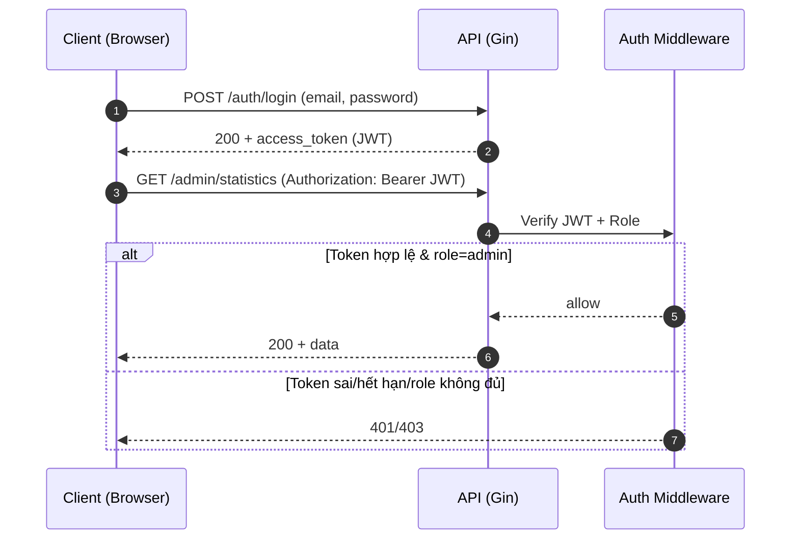
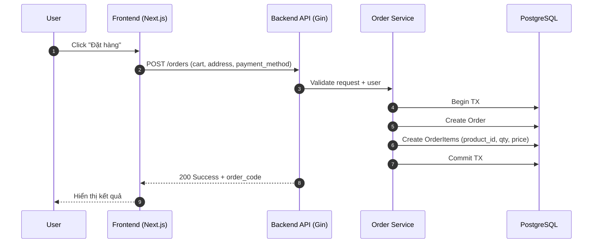

# HƯỚNG DẪN TRÌNH BÀY ĐỒ ÁN TỐT NGHIỆP

## Chuyên ngành: Công Nghệ Thông Tin - Đề tài: Website Bán Hàng Thời Trang Trực Tuyến

**(Tuân thủ quy định Trường Cao đẳng Bách Khoa Sài Gòn)**

---

> **⚠️ LƯU Ý QUAN TRỌNG VỀ TÌNH TRẠNG TRIỂN KHAI:**
>
> Tài liệu này được cập nhật để phản ánh đúng các chức năng **ĐÃ TRIỂN KHAI THỰC TẾ** trong đồ án.
>
> **✅ Các chức năng đã hoàn thành:**
>
> -   **Xác thực và phân quyền:** Đăng ký, đăng nhập, phân quyền Admin/User (Sử dụng JWT).
> -   **Quản lý sản phẩm (Product Management):** Xem danh sách, chi tiết, tìm kiếm, lọc sản phẩm. Admin có thể Thêm/Xóa/Sửa sản phẩm, upload ảnh.
> -   **Quản lý danh mục (Category Management):** Phân loại sản phẩm theo danh mục.
> -   **Giỏ hàng (Shopping Cart):** Thêm sản phẩm, cập nhật số lượng, xóa sản phẩm khỏi giỏ.
> -   **Đặt hàng và Thanh toán (Checkout & Payment):** Quy trình đặt hàng, nhập địa chỉ giao hàng, chọn phương thức thanh toán.
> -   **Quản lý đơn hàng (Order Management):** Người dùng xem lịch sử đơn hàng. Admin quản lý trạng thái đơn hàng.
> -   **Đánh giá sản phẩm (Reviews):** Người dùng có thể đánh giá và bình luận về sản phẩm.
> -   **Quản lý địa chỉ (Address Management):** Thêm, sửa, xóa địa chỉ giao hàng.
> -   **Thống kê (Dashboard):** Xem thống kê doanh thu, số lượng đơn hàng, người dùng (Dành cho Admin).
>
> **❌ Các chức năng chưa triển khai (hoặc đang phát triển):**
>
> -   Tích hợp cổng thanh toán trực tuyến thực tế (VNPay, MoMo) - *Hiện tại đang mô phỏng*.
> -   Chat trực tuyến (Support).
> -   Gợi ý sản phẩm thông minh (AI Recommendation).

---

## PHẦN I: QUY ĐỊNH VỀ HÌNH THỨC TRÌNH BÀY

### 1. Định dạng trang giấy và văn bản

-   **Khổ giấy:** A4.
-   **Căn lề:**
    -   Lề trái: 3 cm.
    -   Lề phải, trên, dưới: 2 cm.
-   **Font chữ:** Times New Roman.
-   **Cỡ chữ (Size):** 13.
-   **Giãn dòng (Line spacing):** 1.5.
-   **Màu chữ:** Màu đen (Hình vẽ, đồ thị, logo trường có thể in màu).
-   **Trang trí:** Không được dùng hoa văn, hình vẽ để trang trí hoặc làm đề dẫn ở đầu mỗi trang/chương. Không trích dẫn tục ngữ, thành ngữ.

### 2. Đánh số trang

-   Vị trí: Ở giữa trang, phía dưới.
-   Bắt đầu đánh số trang (trang 1) từ trang đầu tiên của **Chương 1** cho đến hết trang cuối của phần **Kết luận**.
-   Các trang mục lục, lời mở đầu, danh mục... đánh số La Mã.

### 3. Đánh số chương mục

-   **Chương:** Dùng số Ả Rập (1, 2, 3...).
-   **Mục:** Đánh số theo cấp (Ví dụ: 1.1, 1.2...).
-   **Tiểu mục:** Đánh số tối đa 3 cấp (Ví dụ: 1.1.1, 1.1.2...).

### 4. Quy cách đóng quyển

-   **Bìa:** Bìa cứng màu đỏ, in chữ nhũ vàng.
-   **Gáy:** Đóng bằng đinh bấm, bọc gáy (Không đóng lò xo, không đục lỗ).

---

## PHẦN II: CẤU TRÚC CHI TIẾT CỦA BÁO CÁO

Sinh viên sắp xếp các trang theo đúng thứ tự sau đây:

1. **Trang bìa ngoài** (Bìa cứng màu đỏ, chữ nhũ vàng).
2. **Trang bìa trong** (Trình bày giống trang bìa ngoài, giấy thường).
3. **Lời mở đầu** (Đánh số La Mã, viết ngắn gọn).
4. **Lời cảm ơn** (Đánh số La Mã).
5. **Nhận xét của cơ quan thực tập** (Nếu có, đánh số La Mã).
6. **Nhận xét của giảng viên hướng dẫn** (Đánh số La Mã).
    - _Lưu ý:_ GVHD nhận xét về kết cấu, phương pháp, cơ sở lý luận, tính thực tiễn và kết quả (Đạt/Không đạt). Không cho điểm vào trang này.
7. **Danh mục các bảng biểu, sơ đồ, hình...** (Đánh số La Mã).
8. **Danh mục các từ viết tắt** (Nếu có, xếp sau danh mục bảng biểu).
9. **Mục lục** (Đánh số La Mã).
10. **Nội dung chính** (Bắt đầu đánh số trang 1).
11. **Tài liệu tham khảo** (Theo tiêu chuẩn Harvard, xếp sau phần kết luận).
12. **Phụ lục** (Xếp sau tài liệu tham khảo).

---

## PHẦN III: NỘI DUNG CHUYÊN MÔN (Đã chuẩn hóa theo dự án)

Nhà trường quy định kết cấu 3 chương chính. Dưới đây là cách ánh xạ nội dung "Website Bán Hàng Thời Trang" vào cấu trúc này:

---

## 0. TƯ DUY GIẢI QUYẾT VẤN ĐỀ (QUAN TRỌNG NHẤT)

> **Mục tiêu:** Hội đồng không chỉ chấm "làm được gì" mà chấm **"tại sao làm như vậy"** và **"đã xử lý khó khăn ra sao"**.

### 0.1. Cách viết để thể hiện tư duy (mẫu dùng cho mọi chương)

Khi trình bày bất kỳ quyết định kỹ thuật nào (chọn công nghệ, thiết kế DB, xử lý bảo mật, tối ưu hiệu năng), hãy viết theo cấu trúc:

1. **Bối cảnh & yêu cầu**: hệ thống cần gì? ràng buộc gì? (thời gian, kỹ năng, chi phí, hiệu năng, bảo mật)
2. **Các phương án**: ít nhất 2 lựa chọn (A/B), nêu rõ điểm mạnh/yếu.
3. **Tiêu chí chọn**: hiệu năng, concurrency, SEO, maintainability, dễ triển khai, hệ sinh thái.
4. **Quyết định & lý do**: chọn gì và vì sao phù hợp nhất với bối cảnh dự án.
5. **Khó khăn gặp phải**: lỗi/điểm nghẽn thật (ví dụ: JWT hết hạn, CORS, upload ảnh, race condition khi đặt hàng).
6. **Cách xử lý**: giải pháp, đánh đổi, cách kiểm chứng (test API bằng Postman, log, đo thời gian phản hồi).
7. **Kết quả**: minh chứng bằng hình ảnh, log, hoặc chỉ số (p95 latency, thời gian load trang, số request đồng thời).

### 0.2. Checklist “điểm cộng” cho tư duy

-   Mỗi công nghệ cốt lõi đều có **lý do lựa chọn** (không liệt kê suông).
-   Có **bảng so sánh nhỏ** (ví dụ: Golang vs NodeJS).
-   Có **sơ đồ luồng** (JWT), **sơ đồ tuần tự** (đặt hàng), **ERD** (quan hệ + khóa ngoại).
-   Thành thật về **hạn chế** (thanh toán thật chưa tích hợp) và có **hướng phát triển** hợp lý.

> **📋 CHÚ GIẢI KÝ HIỆU NGUỒN THÔNG TIN:**
>
> | Ký hiệu                 | Ý nghĩa                                                    | Cách thực hiện                                  |
> | ----------------------- | ---------------------------------------------------------- | ----------------------------------------------- |
> | 🌐 _TÌM KIẾM TRÊN MẠNG_ | Nội dung cần tìm kiếm, nghiên cứu từ Internet              | Tìm trên Google, Wikipedia, tài liệu chính thức |
> | 📁 _DỰA VÀO DỰ ÁN_      | Nội dung lấy trực tiếp từ source code, database, giao diện | Xem code, chạy ứng dụng, chụp màn hình          |
> | 🌐 + 📁                 | Kết hợp cả hai nguồn                                       | Lý thuyết từ mạng + áp dụng vào dự án           |

### LỜI MỞ ĐẦU

_(Phần giới thiệu tổng quát về đề tài, nằm trước Chương 1)_

**1. Lý do chọn đề tài (Đặt vấn đề)** 🌐 _TÌM KIẾM TRÊN MẠNG_

-   **Tính cấp thiết có số liệu:** Không viết chung chung "TMĐT phát triển". Hãy trích dẫn ít nhất 1–2 số liệu từ nguồn uy tín (báo cáo ngành, tổ chức nghiên cứu, doanh nghiệp lớn).
    -   Ví dụ cách viết: "Theo báo cáo *Google e-Conomy SEA 2025*, quy mô TMĐT Việt Nam đạt **[X]** tỷ USD và tiếp tục tăng trưởng **[Y]%**/năm." *(ghi rõ link/nguồn trong Tài liệu tham khảo)*
    -   Nếu chưa có số liệu: để placeholder **[X]** và bổ sung sau, tránh bịa số.
-   Nhu cầu mua sắm thời trang trực tuyến tăng do tiện lợi, đa dạng lựa chọn, so sánh giá nhanh.
-   Lợi ích của việc chuyển đổi số đối với các cửa hàng thời trang truyền thống.
-   Sự cần thiết của việc xây dựng Website riêng để định vị thương hiệu, thay vì phụ thuộc hoàn toàn vào sàn TMĐT.

**2. Mục tiêu của đề tài** 📁 _DỰA VÀO DỰ ÁN_

-   Xây dựng website bán hàng thời trang trực tuyến, hỗ trợ người dùng mua sắm thuận tiện và doanh nghiệp quản lý hoạt động bán hàng hiệu quả.
-   Thiết kế và triển khai hệ thống theo hướng dễ mở rộng, đảm bảo hiệu năng và an toàn cơ bản.
-   Hoàn thiện các chức năng cốt lõi của một hệ thống thương mại điện tử theo phạm vi đồ án.

**3. Đối tượng và phạm vi nghiên cứu** 📁 _DỰA VÀO DỰ ÁN_

-   **Đối tượng nghiên cứu:**
    -   Hệ thống website thương mại điện tử (E-commerce System).
    -   Quy trình nghiệp vụ mua bán hàng online.
-   **Phạm vi nghiên cứu và triển khai:**
    -   Tập trung vào các nghiệp vụ cốt lõi của website bán hàng thời trang: quản lý sản phẩm, giỏ hàng, đặt hàng, quản trị cơ bản.
    -   Các chức năng được mô tả theo đúng sản phẩm đã triển khai; phần liệt kê chi tiết và minh chứng trình bày tại **Chương 1.3**.
    -   Các tính năng nâng cao (tích hợp cổng thanh toán thực tế, chatbot, gợi ý thông minh, ...) được xem là hướng phát triển.

> **Gợi ý trình bày phạm vi để được đánh giá tốt:**
>
> -   Nhấn mạnh "đã làm được gì" (có minh chứng screenshot/API).
> -   "Chưa làm" hãy ghi trong **Hạn chế** như một sự trung thực khoa học, kèm hướng phát triển.

**4. Ý nghĩa khoa học và thực tiễn** 🌐 + 📁

-   **Ý nghĩa khoa học:**
    -   Nghiên cứu và áp dụng kiến trúc Clean Architecture/Layered Architecture trong Golang.
    -   Tối ưu hóa SEO và hiệu năng Frontend với Next.js và Server-Side Rendering (SSR).
-   **Ý nghĩa thực tiễn:**
    -   Cung cấp công cụ kinh doanh hiệu quả cho doanh nghiệp vừa và nhỏ.
    -   Giúp người dùng tiếp cận sản phẩm thời trang nhanh chóng, tiện lợi.

**5. Cấu trúc của đồ án**

-   Chương 1: Tổng quan về dự án.
-   Chương 2: Cơ sở lý thuyết và Tổng quan công nghệ.
-   Chương 3: Phân tích, thiết kế và triển khai hệ thống.

---

### CHƯƠNG 1: TỔNG QUAN VỀ DỰ ÁN

_(Chương 1 chỉ nói “dự án là gì”, “giải quyết bài toán nào”, “đã làm được gì”, không đi sâu lý thuyết.)_

**1.1. Giới thiệu đề tài và bài toán** 📁 _DỰA VÀO DỰ ÁN_

-   Mô tả ngắn gọn website bán hàng thời trang trực tuyến (đối tượng người dùng, mục đích).
-   Nêu rõ “pain points” cần giải quyết: quản lý sản phẩm/đơn hàng thủ công, thiếu kênh bán hàng riêng, khó theo dõi doanh thu.

**1.2. Đối tượng sử dụng và phân quyền** 📁 _DỰA VÀO DỰ ÁN_

-   **User:** duyệt sản phẩm, giỏ hàng, đặt hàng, quản lý địa chỉ, xem lịch sử đơn, đánh giá.
-   **Admin:** quản lý sản phẩm/danh mục, quản lý đơn hàng, dashboard thống kê.

**1.3. Phạm vi chức năng đã triển khai (cam kết theo sản phẩm thực tế)** 📁 _DỰA VÀO DỰ ÁN_

-   Tóm tắt theo nhóm chức năng (Auth, Product, Cart, Order, Review, Address, Admin Dashboard).
-   Với mỗi nhóm, đính kèm 1–2 hình minh chứng hoặc API endpoint tiêu biểu.

**1.4. Kiến trúc tổng thể hệ thống** 📁 _DỰA VÀO DỰ ÁN_

-   Mô hình Client–Server: Next.js (Frontend) ↔ Gin (Backend API) ↔ PostgreSQL.
-   Upload ảnh sản phẩm và cách lưu trữ (thư mục uploads / bảng liên quan nếu có).

**1.5. Công nghệ sử dụng (liệt kê ngắn gọn)** 📁 _DỰA VÀO DỰ ÁN_

-   Backend: Golang, Gin, GORM, JWT.
-   Frontend: Next.js, Tailwind CSS, Zustand, Axios.
-   Database: PostgreSQL.
-   DevOps/Tools: Docker, Git/GitHub.

---

### CHƯƠNG 2: CƠ SỞ LÝ THUYẾT VÀ TỔNG QUAN CÔNG NGHỆ

_(Chương 2 là phần “lý thuyết + công nghệ lõi”. Không lan man định nghĩa; tập trung đúng cái dự án dùng.)_

**2.1. Tổng quan về Thương mại điện tử** 🌐 _TÌM KIẾM TRÊN MẠNG_

-   Khái niệm cơ bản về Thương mại điện tử.
-   Mô hình B2C (Business to Consumer) áp dụng trong đề tài.
-   Quy trình cơ bản của một giao dịch trực tuyến.

**2.2. Khảo sát các hệ thống tương tự** 🌐 _TÌM KIẾM TRÊN MẠNG_

-   **Thế giới:** Amazon, Alibaba.
-   **Việt Nam:** Shopee, Tiki, Lazada.
-   **Website thương hiệu thời trang:** Zara, H&M, Uniqlo.
-   *Nhận xét ưu/nhược điểm để rút ra bài học cho đề tài.*

**2.3. Công nghệ sử dụng – Ưu điểm và Nhược điểm** 🌐 + 📁

> **Yêu cầu:** Liệt kê rõ ưu/nhược cho từng công nghệ bạn dùng (ngắn gọn, đúng trọng tâm đồ án).

#### 2.3.1. Backend: Golang

-   **Ưu điểm:** hiệu năng tốt; concurrency mạnh (Goroutines); build ra binary dễ deploy; phù hợp API tải cao.
-   **Nhược điểm:** code có thể verbose; hệ sinh thái UI/admin panel không phong phú như Node; cần kỷ luật kiến trúc để dễ mở rộng.

#### 2.3.2. Backend Framework: Gin

-   **Ưu điểm:** nhẹ, routing nhanh, middleware rõ ràng; dễ build REST API.
-   **Nhược điểm:** nhiều thứ cần tự quy ước (structure, validation, error format) để dự án đồng nhất.

#### 2.3.3. ORM: GORM

-   **Ưu điểm:** tăng tốc phát triển CRUD; hỗ trợ migration/association; giảm boilerplate SQL.
-   **Nhược điểm:** query phức tạp có thể khó tối ưu; cần cẩn trọng N+1 query; đôi khi phải dùng raw SQL.

#### 2.3.4. Database: PostgreSQL

-   **Ưu điểm:** ACID; quan hệ mạnh; phù hợp chuẩn hóa (3NF); transaction tốt cho nghiệp vụ đặt hàng.
-   **Nhược điểm:** cần thiết kế index hợp lý; vận hành cần backup/restore đúng quy trình; tuning có độ khó nhất định.

#### 2.3.5. Frontend Framework: Next.js (SSR/SSG vs CSR)

-   **Ưu điểm:** hỗ trợ SSR/SSG giúp SEO tốt cho trang sản phẩm; tối ưu hiệu năng; routing mạnh.
-   **Nhược điểm:** tư duy SSR khác CSR; cần chú ý hydrate; cấu hình build/deploy phức tạp hơn React SPA thuần.

#### 2.3.6. UI: Tailwind CSS

-   **Ưu điểm:** làm UI nhanh; dễ responsive; hạn chế CSS rời rạc.
-   **Nhược điểm:** className dài; cần quy ước component hóa để tránh rối.

#### 2.3.7. State Management: Zustand

-   **Ưu điểm:** nhẹ, dễ dùng; phù hợp state toàn cục như cart/auth; ít boilerplate.
-   **Nhược điểm:** nếu không tổ chức store tốt sẽ khó maintain; cần cẩn thận khi persist/rehydrate.

#### 2.3.8. HTTP Client: Axios

-   **Ưu điểm:** interceptors tiện cho attach token; xử lý lỗi/timeout rõ; phổ biến.
-   **Nhược điểm:** thêm dependency; cần chuẩn hóa error handling để đồng nhất toàn app.

#### 2.3.9. Bảo mật: JWT (Authentication/Authorization)

-   **Ưu điểm:** stateless; phù hợp kiến trúc FE/BE tách rời; dễ mở rộng phân quyền.
-   **Nhược điểm:** cần xử lý refresh/expiry; rủi ro XSS nếu lưu token sai cách; cần chuẩn hóa 401/403.

**Sơ đồ 2.1: Luồng JWT (Client → Server → Verify → Response)**



#### 2.3.10. DevOps/Tools: Docker, Git/GitHub

-   **Docker – Ưu điểm:** đóng gói môi trường chạy; dễ triển khai; nhất quán dev/prod.
-   **Docker – Nhược điểm:** cần hiểu compose/network/volume; debug đôi khi khó hơn chạy local.
-   **Git/GitHub – Ưu điểm:** quản lý phiên bản; trace thay đổi; hỗ trợ teamwork.
-   **Git/GitHub – Nhược điểm:** cần kỷ luật branch/commit; dễ conflict nếu workflow không rõ.

**Bảng 2.1: So sánh nhanh Golang vs NodeJS (minh chứng hiểu biết)**

| Tiêu chí | Golang | NodeJS |
| --- | --- | --- |
| Hiệu năng | Thường tốt, ổn định ở tải cao | Tốt cho I/O, nhưng dễ phụ thuộc vào cách viết async + event loop |
| Concurrency | Goroutines nhẹ, dễ scale concurrent | Event loop + async/await; CPU-bound cần worker/cluster |
| Triển khai | Build ra 1 binary, dễ chạy | Cần runtime Node + quản lý dependencies |
| Maintainability | Rõ ràng nếu theo Clean Architecture | Linh hoạt, nhưng dễ “spaghetti” nếu thiếu chuẩn dự án |

> **Lưu ý:** Bảng chỉ cần nhỏ (4–6 tiêu chí). Nếu bạn so sánh thêm Java Spring Boot, hãy thêm cột thứ 3.

---

### CHƯƠNG 3: PHÂN TÍCH, THIẾT KẾ VÀ TRIỂN KHAI HỆ THỐNG

_(Gộp phần phân tích–thiết kế và phần xây dựng–triển khai để vẫn đúng kết cấu 3 chương của nhà trường.)_

**3.1. Phân tích yêu cầu hệ thống** 📁 _DỰA VÀO DỰ ÁN_

-   **Yêu cầu chức năng chi tiết:**
    -   Mô tả chi tiết các Use Case chính: "Đặt hàng", "Quản lý sản phẩm", "Thanh toán".
    -   Quy trình nghiệp vụ: Khách hàng chọn đồ -> Thêm giỏ -> Checkout -> Admin nhận đơn -> Giao hàng.
-   **Yêu cầu phi chức năng:** Tính bảo mật, tính toàn vẹn dữ liệu, khả năng mở rộng.

**3.2. Đặc tả quy trình nghiệp vụ** 📁 _DỰA VÀO DỰ ÁN_

-   Sơ đồ Use Case tổng quát: Phân rẽ giữa User và Admin.
-   Đặc tả Use Case:
    -   **UC Đăng nhập/Đăng ký:** Người dùng tạo tài khoản để mua hàng.
    -   **UC Quản lý giỏ hàng:** Thêm/sửa/xóa sản phẩm trong session mua sắm.
    -   **UC Thanh toán:** Xác nhận thông tin và hoàn tất đơn hàng.
    -   **UC Quản trị:** Admin thao tác dữ liệu hệ thống.

**3.3. Thiết kế hệ thống (Giải pháp thiết kế)** 📁 _DỰA VÀO DỰ ÁN_

-   **Thiết kế dữ liệu (Database Schema):** _(Tham khảo `backend/internal/models` và `migrations`)_
    -   **Bắt buộc có ERD:** Hội đồng thường soi kỹ phần này. Vẽ ERD bằng draw.io/dbdiagram.io và đảm bảo quan hệ/khóa ngoại rõ ràng.
    -   **Chuẩn hóa:** Trình bày ngắn gọn bạn thiết kế theo hướng tối thiểu **3NF** để giảm dư thừa.
    -   Các bảng chính:
        -   `users`: Lưu thông tin tài khoản, mật khẩu, role.
        -   `products`: Thông tin sản phẩm, giá, mô tả, ảnh.
        -   `categories`: Danh mục sản phẩm.
        -   `files`: Bảng liên kết để lưu trữ ảnh sản phẩm (nếu có tách bảng) hoặc cột images.
        -   `orders`: Đơn hàng (user_id, status, total_price...).
        -   `order_items`: Chi tiết đơn hàng (product_id, quantity, price).
        -   `addresses`: Địa chỉ giao hàng của người dùng.
        -   `reviews`: Đánh giá sản phẩm.
    -   Mô tả quan hệ:
        -   1-n: User → Orders
        -   1-n: Category → Products
        -   n-n: Orders ↔ Products **thông qua bảng trung gian `order_items`** (bảng này phải có FK đến `orders` và `products`).

-   **Sơ đồ tuần tự (Sequence Diagram):** Vẽ ít nhất 1 quy trình "đắt" và có nhiều bước, ví dụ: **Quy trình Đặt hàng**.

**Hình 3.1: Sequence "Đặt hàng" (mẫu tham khảo, nên thay bằng ảnh từ draw.io)**


-   **Thiết kế kiến trúc hệ thống:**
    -   Kiến trúc Client-Server.
    -   Mô hình phân lớp Backend (Clean Architecture):
        -   **Handlers (Presentation):** Xử lý HTTP Request/Response (Gin).
        -   **Services (Business Logic):** Xử lý nghiệp vụ.
        -   **Repositories (Data Access):** Tương tác Database (GORM).
        -   **Models (Entity):** Định nghĩa cấu trúc dữ liệu.


**3.4. Môi trường và Công cụ phát triển** 📁 _DỰA VÀO DỰ ÁN_

-   **Môi trường:**
    -   Hệ điều hành: Windows/Linux/macOS.
    -   Platform: Node.js (Frontend), Golang (Backend).
    -   Database: PostgreSQL.
-   **Công cụ:**
    -   IDE: Visual Studio Code.
    -   API Testing: Postman/Insomnia.
    -   Version Control: Git/GitHub.
    -   Database Tool: pgAdmin/DBeaver.

**3.5. Tổ chức mã nguồn** 📁 _DỰA VÀO DỰ ÁN_

-   **Nguyên tắc vàng:** Không dán nguyên cây thư mục và không copy toàn bộ source code vào báo cáo.
-   Chỉ trình bày cấu trúc ở mức **khái quát** (1–2 đoạn) để hội đồng hiểu bạn tổ chức code có chủ đích.
-   Khi cần minh chứng, hãy đưa **đoạn code "đắt giá"** (ngắn, đúng chỗ, có giải thích) thay vì dán dài.

Ví dụ cách mô tả (ngắn gọn):

-   Backend chia theo lớp: `handlers` (HTTP), `services` (nghiệp vụ), `repositories` (truy cập DB), `middleware` (JWT/role), `models` (entity).
-   Frontend tách `app` (routing), `components` (UI tái sử dụng), `services` (call API), `store` (Zustand).

**3.6. Xây dựng các chức năng chính** 📁 _DỰA VÀO DỰ ÁN_

-   **Backend:** Xây dựng CRUD API cho Products, Categories, Orders. Xử lý xác thực JWT và phân quyền Admin/User.
-   **Frontend:**
    -   Tích hợp API Backend.
    -   Quản lý State toàn cục với Zustand (Giỏ hàng, User User).
    -   Xử lý giao diện Responsive với Tailwind CSS.
    -   Xây dựng các trang Admin Dashboard.

> **Gợi ý “show code đắt giá” (nên chụp/copy đúng 10–40 dòng):**
>
> -   Middleware xác thực & phân quyền Admin (Golang).
> -   Logic tạo đơn hàng theo transaction (tạo `orders` + `order_items`).
> -   Hàm tính tổng tiền giỏ hàng (Frontend hoặc Backend) và xử lý làm tròn/định dạng.
> -   Cấu hình Zustand store (persist, actions) cho giỏ hàng.

**3.7. Kết quả giao diện hệ thống** 📁 _DỰA VÀO DỰ ÁN_ _(Chụp màn hình)_

-   **Các màn hình cần đưa vào báo cáo:**
    -   Trang chủ (Home Page): Hiển thị banner, sản phẩm nổi bật.
    -   Trang danh sách sản phẩm (Shop/Product List): Bộ lọc, phân trang.
    -   Trang chi tiết sản phẩm (Product Detail): Thông tin, ảnh, đánh giá.
    -   Trang giỏ hàng (Cart): Danh sách item, tổng tiền.
    -   Trang thanh toán (Checkout): Form thông tin giao hàng.
    -   Trang Admin Dashboard: Biểu đồ thống kê.
    -   Trang Admin Quản lý Sản phẩm/Đơn hàng.

> **Bắt buộc có chú thích dưới mỗi hình:**
>
> -   Ví dụ: "Hình 3.5: Giao diện chi tiết sản phẩm với hiển thị đánh giá và nút thêm vào giỏ".
> -   Tránh để hình trơ trọi không giải thích.

**3.8. Triển khai hệ thống** 📁 _DỰA VÀO DỰ ÁN_

-   Hướng dẫn chạy local:
    -   Backend: `go run cmd/server/main.go`
    -   Frontend: `npm run dev`
-   Triển khai Production (Docker/VPS) - *Nếu có*.

**3.9. Đánh giá kết quả và Hướng phát triển**

-   **Kết quả:** Hệ thống hoạt động ổn định, đáp ứng các nghiệp vụ mua bán cơ bản. Giao diện thân thiện, tốc độ nhanh.
-   **Hạn chế:** Chưa có thanh toán online thật, chưa có chat support.
-   **Hướng phát triển:** Mobile App, tích hợp AI, mở rộng kho hàng.

---

### PHẦN KẾT LUẬN

-   Tổng kết lại quá trình thực hiện đồ án.
-   Khẳng định tính thực tế của ứng dụng Website Bán Hàng Thời Trang.
-   Bài học kinh nghiệm về công nghệ Golang và Next.js.

---

### TÀI LIỆU THAM KHẢO

1.  Golang Documentation. *The Go Programming Language*.
2.  Next.js Documentation. *Next.js by Vercel*.
3.  Gin Gonic Documentation.
4.  GORM Guides.
5.  Tailwind CSS Documentation.

> **Khuyến nghị để tăng tính học thuật:** bổ sung 1–2 tài liệu/báo cáo ngành có số liệu (quy mô TMĐT Việt Nam/SEA) và trích dẫn đúng chuẩn.

---

### PHỤ LỤC

-   Các đoạn code cấu hình quan trọng.
-   Hướng dẫn người dùng (User manual).

---

## PHẦN IV: CÁC MẪU TRANG QUAN TRỌNG

_(Sinh viên phải làm đúng theo format này)_

**1. Mẫu trang bìa:**
Plaintext

```
BỘ GIÁO DỤC VÀ ĐÀO TẠO (Bold, size 14)
TRƯỜNG CAO ĐẲNG BÁCH KHOA SÀI GÒN (Bold, size 16)
KHOA CÔNG NGHỆ THÔNG TIN (Bold, size 16)

[LOGO TRƯỜNG]

ĐỒ ÁN TỐT NGHIỆP (Bold, size 16)

XÂY DỰNG WEBSITE BÁN HÀNG THỜI TRANG TRỰC TUYẾN
(Bold, size 18-30 tùy số chữ)

Giảng viên hướng dẫn: ThS. NGUYỄN VĂN A (Bold, size 14, in hoa)
Sinh viên thực hiện:  NGUYỄN VĂN B (Bold, size 14, in hoa)
Lớp:                 CD21CNTT (Bold, in hoa, size 14)
Khoá:                2021-2024 (Bold, in hoa, size 14)

Thành phố Hồ Chí Minh, tháng 01 năm 2026 (Bold, size 13)
```

**2. Mẫu tiêu đề chương:**
Plaintext

```
CHƯƠNG 1: TỔNG QUAN
(Bold, size 14, chữ in hoa, canh giữa hoặc trái tùy thẩm mỹ nhưng phải in đậm)
```

**3. Mẫu danh mục bảng biểu:**
Plaintext

```
DANH MỤC CÁC BẢNG, SƠ ĐỒ, HÌNH (In đậm, in hoa, size 14)

BẢNG 1.1: Danh sách nhân viên........................... Trang 5
HÌNH 3.1: Sơ đồ Use Case tổng quát...................... Trang 12
(Lưu ý: Chữ số thứ nhất chỉ tên chương, chữ số thứ 2 chỉ thứ tự)
```
